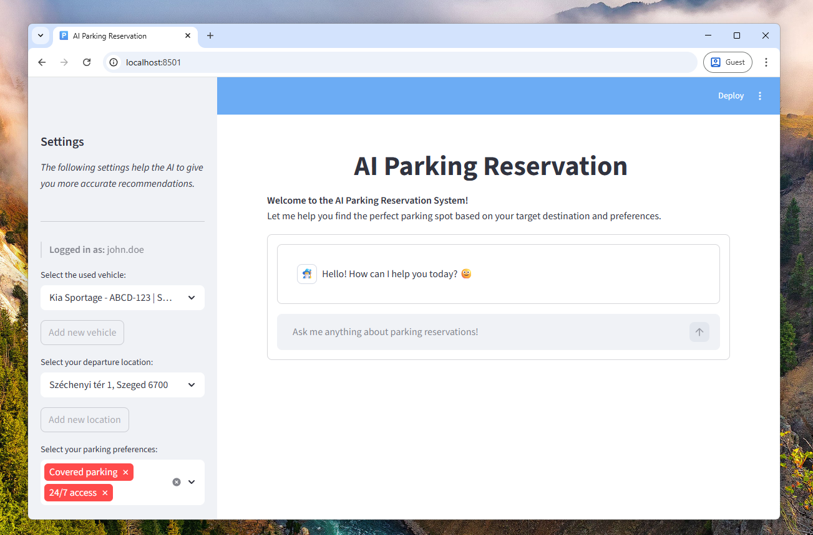

# AI Parking Space Reservation 🚀

**This is a final practical task of an AI Engineering course.**

> The goal of the project is to develop an intelligent chatbot that:
> - Provides an intuitive interface.
> - Can interact with users and provide information about parking spaces.
> - Using the preferences and related data of the user to provide better, personalized recommendations.
> - Handle the reservation process, and involve a human administrator for confirmation ("human-in-the-loop").

**Details**

- **Programming Language**: Python.
- **Frameworks**: LangChain, LangGraph.
- **Architecture**: Agentic RAG Chatbot.
- **Storage**: Weaviate vector database for static data and semantic search, PostgreSQL for dynamic data.

---
## Vision

> ### An AI-powered chatbot app that makes it easier to organize your trips. 🛫
> **We help finding and reserving the right parking lot for you.** 
> Our solution is not only booking a parking slot for you, but also helps you find the best parking space to park in. It provides you with an intuitive interface, detailed information, filter by your preferences, and more. With our application, you can easily book a parking spot with AI assistance. Our solution is based on natural language processing.

The usecase is to help people find available and suitable parking spaces in the neighborhood of airports, cities, based on their preferences.

---
## Setup instructions - How to run? 🏃

> **Prerequisites**
> - Python 3.12 or higher
> - [UV - Python package manager](https://docs.astral.sh/uv/getting-started/installation/) installed
> - **Docker** is installed, enabled and running on your system

1. Clone this repository using: `git clone https:github.com/1amG4bor/ai-parking-space-reservation`
2. Go into the folder and do the initial setup _(create virtualenv, install dependencies)_ using: `uv sync`
3. Run the backend systems using: `uv run backend`
4. Run the chatbot using: `uv run app`

_and you are ready to go.._ 
💬: *"How can I help you today?"*

---
## Testing and Evaluation 📋

How to run tests and evaluation scipts?

- Run unit tests: `uv run unit_test`
- Evaluate the retrival job: `uv run eval_retrieval` - *> TBD*
- Evaluate model performance: `uv run eval_rag`
    - _Evaluate the full RAG system and  assess both the retrieval and the generation components._
    - _**Note**: The evaluation script will take a while to run, so please be patient. The evaluation results will be saved into an Excel sheet to the project's root folder._

---
## Architecture 🏗️

_The architecture contains the following components._

1. **Retrieval-Augmented Generation (RAG)** - This component uses a vector database to store and retrieve detailed information about parking spaces to assist in finding suitable parking spaces. The retrieval process is based on cosine similarity between the query built by the agent and all the available documents about parking spaces. 
    - **Vector Database** - A vector database stores the detailed information about parking spaces, including their location, price, and other relevant information. 
    - **Embedding service** - The embedding service is responsible for converting the textual information about parking spaces into vector representations that can be stored in the vector database and used for retrieval. 
    For the embedding service, we use ollama which is a local LLM hosting solution, and we use the `nomic-embed-text` model to generate the embeddings for the documents and queries.
2. **Chatbot UI**  - The user interface allows users to interact with the system by asking questions and receiving responses. The Chatbot which accessed via this UI is not only provide useful information but also used to book parking spaces and reserve them for a specific time period.
    - The UI is implemented with Streamlit and Python, to make an easy to setup environment for development and testing.
3. **Guardrails**  - Guardrail components are designed to prevent exposure of any sensitive data to the public and also ensure the system operates within defined safety and ethical boundaries. This includes to avoid processing harmful, inappropriate, or malicious prompts.
4. **Evaluator and development scripts**  - The evaluator package contains many scripts that are used to set up and evaluate the performance of individual components or the full AI system.the chatbot. It provides a way to compare the performance of different versions of the chatbot and determine which version is most effective.
    - **Vector DB uploader** - Generate the embeddings for the documents and uploads them to the vector database.
    - **Populate SQL db** - Populate the SQL database with dynamic data that can be used in the Agentic RAG system. The script initializes the database and creates all the db tables, and then populates the tables with sample data.
    - **Semantic search eval** - Evaluate the retrieval performance of the system by running semantic search on the vector database to find relevant documents based on a query and top_k config.
    - **RAG evaluation** - Evaluate the full RAG system and assess both the retrieval and the generation components. The evaluation results are saved into an Excel sheet to the project's root folder.

---
## Contributing 🤝

> **ℹ️ Contributions are always welcome, please open an issue or submit a pull request.**

### Utility scripts

Quality assurance
- Running the linter: `uv run linter`
- Formatting the code: `uv run code_format`
- Running the unittests: `uv run unit_test`
- Running pre commit checks: `uv run pre_commit` _(includes formatting and linting the code then running unit tests)_
Running the application
- Start/Run the backend services: `uv run backend`
- Start/Run the frontend (Streamlit UI): `uv run app`
Running the evaluation scripts
- Running the performance evaluation script: `uv run performance_test`
- Running the accuracy evaluation script: `uv run accuracy_test`

### Project structure

The `src` folder contains the following packages and modules.

- `chat_engine`: implementation of the agentic RAG system.
    - `core`: contains the core components of the RAG system.
        - `agents`: contains different agents and their utilities used by the whole system. 
        It includes agent models, toolds, middlewares, and guardrail components.
        - `config`: common configuration files, constants, and logger setup.
        - `rag`: components related to the retrieval parts of the Retrieval-Augmented Generation system.
        - `utils`: utility functions and helper components used across the whole system.
    - `engine`: contains the chat_engine and relevant components controlling the interaction with Agent.
    - `models`: contains the response models, database entities and enums holding predefined values.
- `ui`: implementation of the Streamlit UI for the chatbot.
    - app: the main Streamlit app that handles the user interactions.
    - callback: contains the handler functions that responsible for displaying the chat engine's responses on the UI.
    - helper: contains helper functions and base UI components displayed on the UI.

**Additional folders**:
- `cicd`: contain scripts for quality assurance checks and deployment.
- `data`: contain static and dynamic test data to support the development and testing of the system.
- `evaluation`: contains scripts for pre-development, testing, and evaluating the performance of the system.
- `tests`: contains unit tests for the different components and modules of the system.

---

## Presentation

- [ASPR-Presentation - PowerPoint](ASPR-Presentation.pptx)
